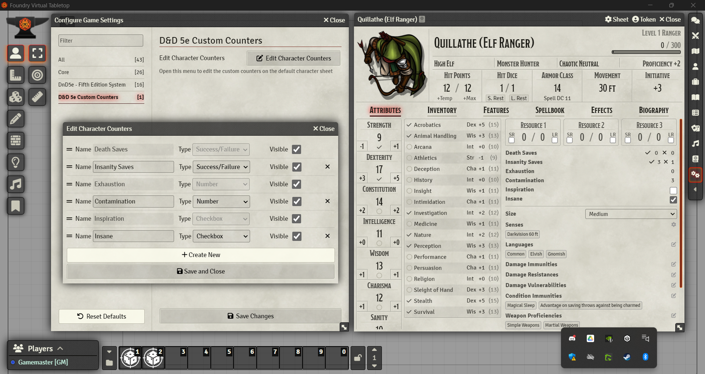

 

# D&D 5e Custom Counters

A simple Foundry VTT utility to add custom counters to the default D&D 5e character sheet.

# Features

- Add three types of counter: Checkbox, Number, Success/Failure.
- Change the order by dragging and dropping in the settings menu.
- Hide existing counters.