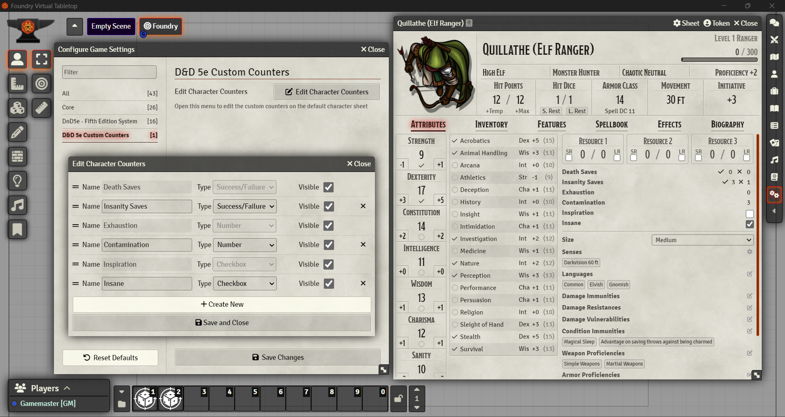

 

# D&D 5e Custom Counters

A Foundry VTT module to add custom counters to the default D&D 5e character sheet.

## Custom Counters on the New Sheet

## Custom Counters on the Legacy Sheet

# Features

- Add four types of counter: Checkbox, Fraction, Number, Success/Failure.
- Change the order by dragging and dropping in the settings menu.
- Hide existing counters: Death Saves, Exhaustion, Inspiration, Legendary Actions, Legendary Resistances and Lair Actions.
- Supports the new character sheet.

# Recommended Modules
## [Dynamic Active Effects](https://foundryvtt.com/packages/dae)
For games on dnd5e 2.4.1 or lower, Dynamic Active Effects adds the flag properties to the actor, which allows custom counters to be added to the roll formulas for attacks and damage. To copy the property path:
1. Open D&D 5e Custom Counters' module settings
2. Open either the 'Edit Character Counters' or 'Edit NPC Counters' menu
3. Click the @ symbol next to the counter to copy the property path into the clipboard
4. Paste the property path into roll formula fields as required

